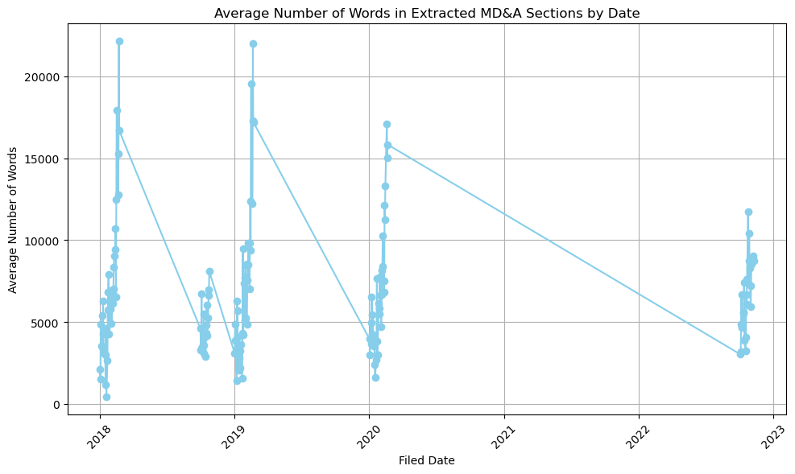
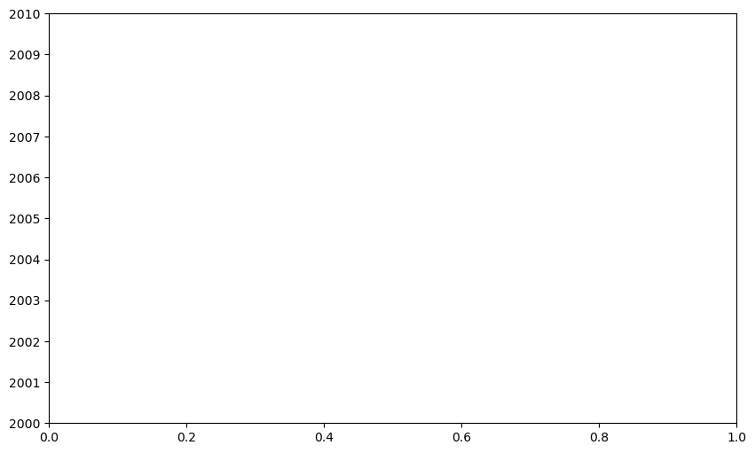

```python
import pandas as pd
import matplotlib.pyplot as plt
```


```python
import pandas as pd

# Replace 'path/to/Only_MDA.xlsx' with the actual path to your file
file_path = '/Users/yuxuanzhang/Desktop/Only_MDA.xlsx'

# Read the Excel file into a pandas DataFrame
qtr1_n_4_2018 = pd.read_excel(file_path)

# Now you can work with the DataFrame 'df'
# For example, you can print the first few rows using df.head():
print(qtr1_n_4_2018.head())
```

            Date document_type ticker               title  cik_str  num_words  \
    0 2018-01-02          10-Q   SURG     SurgePays, Inc.  1392694       1337   
    1 2018-01-02          10-Q    NaN                 NaN  1606364          1   
    2 2018-01-02          10-Q   CLOW      Cloudweb, Inc.  1619227       2730   
    3 2018-01-02          10-K   EXDW  Exceed World, Inc.  1634293        717   
    4 2018-01-02          10-K   VERU           VERU INC.   863894       5644   
    
                                                   Value  
    0  Management's Discussion and Analysis of Financ...  
    1                                       Management's  
    2  Management's DISCUSSION AND ANALYSIS OF FINANC...  
    3  Management's Discussion. and Analysis of Finan...  
    4  Management's Discussion and Analysis of Financ...  


```python
qtr1_n_4_2018['num_words'].describe()
```


    count     10124.000000
    mean       9685.282299
    std       11720.406976
    min           1.000000
    25%        1863.000000
    50%        6074.000000
    75%       12432.500000
    max      130458.000000
    Name: num_words, dtype: float64


```python
#512 as finbert model has the maximum token counts of 512

count_occurrences = qtr1_n_4_2018[qtr1_n_4_2018['num_words'] < 512].shape[0]
print(count_occurrences)
```

    1854


```python
import pandas as pd
import matplotlib.pyplot as plt

# Assuming you have the DataFrame with the 'Filed_At' and 'num_words' columns, let's call it 'df'
# Replace 'df' with the name of your DataFrame

# Convert the 'Filed_At' column to a datetime data type
qtr1_n_4_2018['Date'] = pd.to_datetime(qtr1_n_4_2018['Date'])

# Group the data by date and calculate the average number of words for each date
average_words_by_date = qtr1_n_4_2018.groupby('Date')['num_words'].mean().reset_index()

# Plot the data
plt.figure(figsize=(10, 6))
plt.plot(average_words_by_date['Date'], average_words_by_date['num_words'], marker='o', color='skyblue')
plt.xlabel('Filed Date')
plt.ylabel('Average Number of Words')
plt.title('Average Number of Words in Extracted MD&A Sections by Date')
plt.xticks(rotation=45)
plt.grid(True)
plt.tight_layout()
plt.show()
```


    

    


```python
qtr1_n_4_2018['Date'] = pd.to_datetime(qtr1_n_4_2018['Date'])

# Filter the DataFrame to get only 10-K filings
df_10k = qtr1_n_4_2018[qtr1_n_4_2018['document_type'] == '10-K']

# Filter the DataFrame to get only 10-Q filings
df_10q = qtr1_n_4_2018[qtr1_n_4_2018['document_type'] == '10-Q']


# Plot the 10-K data
plt.figure(figsize=(10, 6))
plt.plot(df_10k, marker='o', color='skyblue', label='10-K')
plt.ylabel('Average Number of Words')
plt.title('Average Number of Words in Extracted 10-K MD&A Sections by Quarter')
plt.xticks(rotation=45)
plt.grid(True)
plt.legend()
plt.tight_layout()
plt.show()

# Plot the 10-Q data
plt.figure(figsize=(10, 6))
plt.plot(df_10q, average_words_10q_by_quarter['num_words'], marker='o', color='orange', label='10-Q')
plt.ylabel('Average Number of Words')
plt.title('Average Number of Words in Extracted 10-Q MD&A Sections by Quarter')
plt.xticks(rotation=45)
plt.grid(True)
plt.legend()
plt.tight_layout()
plt.show()


```


    ---------------------------------------------------------------------------

    ValueError                                Traceback (most recent call last)

    ~/opt/anaconda3/lib/python3.9/site-packages/matplotlib/axis.py in convert_units(self, x)
       1505         try:
    -> 1506             ret = self.converter.convert(x, self.units, self)
       1507         except Exception as e:


    ~/opt/anaconda3/lib/python3.9/site-packages/matplotlib/dates.py in convert(self, *args, **kwargs)
       1921     def convert(self, *args, **kwargs):
    -> 1922         return self._get_converter().convert(*args, **kwargs)
       1923 


    ~/opt/anaconda3/lib/python3.9/site-packages/matplotlib/dates.py in convert(value, unit, axis)
       1850         """
    -> 1851         return date2num(value)
       1852 


    ~/opt/anaconda3/lib/python3.9/site-packages/matplotlib/dates.py in date2num(d)
        445             d = np.asarray(d)
    --> 446         d = d.astype('datetime64[us]')
        447 


    ValueError: Error parsing datetime string "10-K" at position 3

    
    The above exception was the direct cause of the following exception:


    ConversionError                           Traceback (most recent call last)

    /var/folders/2z/v33d68yn3h9c2zf6z1r1mb4m0000gn/T/ipykernel_39969/1232606449.py in <module>
         10 # Plot the 10-K data
         11 plt.figure(figsize=(10, 6))
    ---> 12 plt.plot(df_10k, marker='o', color='skyblue', label='10-K')
         13 plt.ylabel('Average Number of Words')
         14 plt.title('Average Number of Words in Extracted 10-K MD&A Sections by Quarter')


    ~/opt/anaconda3/lib/python3.9/site-packages/matplotlib/pyplot.py in plot(scalex, scaley, data, *args, **kwargs)
       2767 @_copy_docstring_and_deprecators(Axes.plot)
       2768 def plot(*args, scalex=True, scaley=True, data=None, **kwargs):
    -> 2769     return gca().plot(
       2770         *args, scalex=scalex, scaley=scaley,
       2771         **({"data": data} if data is not None else {}), **kwargs)


    ~/opt/anaconda3/lib/python3.9/site-packages/matplotlib/axes/_axes.py in plot(self, scalex, scaley, data, *args, **kwargs)
       1632         lines = [*self._get_lines(*args, data=data, **kwargs)]
       1633         for line in lines:
    -> 1634             self.add_line(line)
       1635         self._request_autoscale_view(scalex=scalex, scaley=scaley)
       1636         return lines


    ~/opt/anaconda3/lib/python3.9/site-packages/matplotlib/axes/_base.py in add_line(self, line)
       2286             line.set_clip_path(self.patch)
       2287 
    -> 2288         self._update_line_limits(line)
       2289         if not line.get_label():
       2290             line.set_label(f'_child{len(self._children)}')


    ~/opt/anaconda3/lib/python3.9/site-packages/matplotlib/axes/_base.py in _update_line_limits(self, line)
       2309         Figures out the data limit of the given line, updating self.dataLim.
       2310         """
    -> 2311         path = line.get_path()
       2312         if path.vertices.size == 0:
       2313             return


    ~/opt/anaconda3/lib/python3.9/site-packages/matplotlib/lines.py in get_path(self)
        997         """Return the `~matplotlib.path.Path` associated with this line."""
        998         if self._invalidy or self._invalidx:
    --> 999             self.recache()
       1000         return self._path
       1001 


    ~/opt/anaconda3/lib/python3.9/site-packages/matplotlib/lines.py in recache(self, always)
        654             x = self._x
        655         if always or self._invalidy:
    --> 656             yconv = self.convert_yunits(self._yorig)
        657             y = _to_unmasked_float_array(yconv).ravel()
        658         else:


    ~/opt/anaconda3/lib/python3.9/site-packages/matplotlib/artist.py in convert_yunits(self, y)
        262         if ax is None or ax.yaxis is None:
        263             return y
    --> 264         return ax.yaxis.convert_units(y)
        265 
        266     @property


    ~/opt/anaconda3/lib/python3.9/site-packages/matplotlib/axis.py in convert_units(self, x)
       1506             ret = self.converter.convert(x, self.units, self)
       1507         except Exception as e:
    -> 1508             raise munits.ConversionError('Failed to convert value(s) to axis '
       1509                                          f'units: {x!r}') from e
       1510         return ret


    ConversionError: Failed to convert value(s) to axis units: array(['10-K', '10-K', '10-K', ..., '10-K', '10-K', '10-K'], dtype=object)


    

    


```python

```
